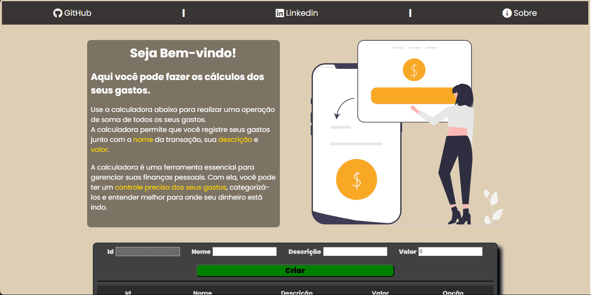
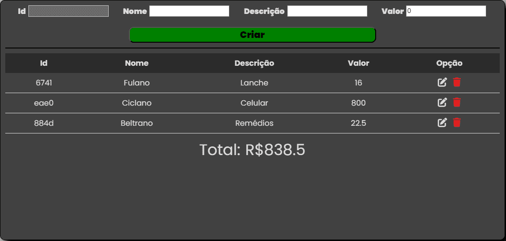

<h1 align="center">Angular-Cost-Calculator:</h1>

## 📲 View the project here
<a href="https://angular-cost-calculator.vercel.app">https://angular-cost-calculator.vercel.app</a>

## 📖 About the project
This project aimed to improve my skills with Angular, serving as a self-directed educational endeavor. Through it, I could delve deeper into the concepts of full-stack development and learn how to consume APIs using Angular.

The project revolves around a cost calculator, allowing users to input data for calculation and organization, including:
- Name
- Description
- Value

The database is a simple JSON file, and it is served by JSON Server, functioning as the backend.



### Calculator component


## 🦾 Technologies used
<div style="display: flex;">
  


</div>

## 🤔 What i learned
- I learned how to consume APIs with Angular.
- I improved my skills in componentization.
- I enhanced my skills in JSON, data, and Angular overall.

## 👽 How to clone this project

````bash
    # Select where you want to clone
    $ cd ~/Documents/WHERE_YOU_WANT
````

````bash
    # Clone the project
    $ git clone https://github.com/DevGustavus/REPOSITORY_NAME.git
````

````bash
    # Check if cloning worked fine
    $ cd ~/Documents/DIRECTORY_LOCATION
    $ ls
````

## 🅰️ Angular CLI commands to run the project

This project was generated with [Angular CLI](https://github.com/angular/angular-cli) version 16.2.4.

## Development server

Run `ng serve` for a dev server. Navigate to `http://localhost:4200/`. The application will automatically reload if you change any of the source files.

## Code scaffolding

Run `ng generate component component-name` to generate a new component. You can also use `ng generate directive|pipe|service|class|guard|interface|enum|module`.

## Build

Run `ng build` to build the project. The build artifacts will be stored in the `dist/` directory.

## Running unit tests

Run `ng test` to execute the unit tests via [Karma](https://karma-runner.github.io).

## Running end-to-end tests

Run `ng e2e` to execute the end-to-end tests via a platform of your choice. To use this command, you need to first add a package that implements end-to-end testing capabilities.

## Further help

To get more help on the Angular CLI use `ng help` or go check out the [Angular CLI Overview and Command Reference](https://angular.io/cli) page.
